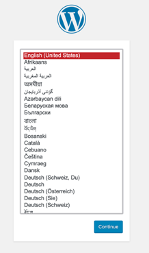
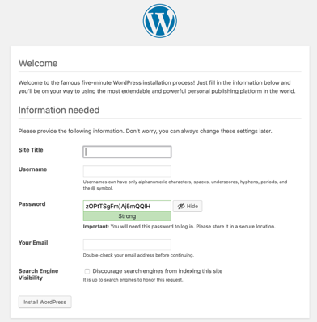
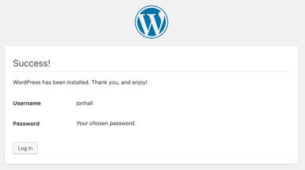
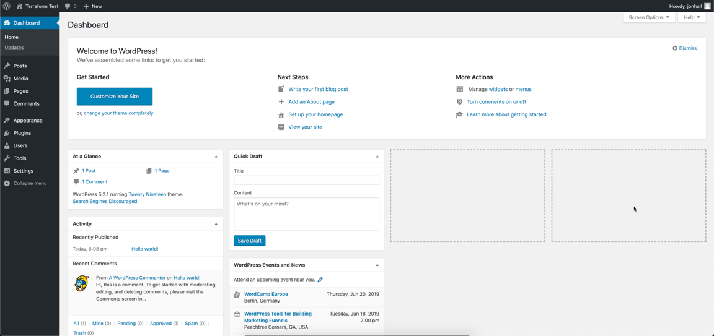

## Purpose

This section provides the steps to modify the Ansible Playbooks to configure the application software previously installed on the VSIs.  

### Prerequisites

1. Infrastructure has been successfully provisioned using the Terraform plan in the previous steps and all post provisioning installation is complete.
    - terraform.tfstate file created during the Terraform "apply" is accessible
    - IBM Cloud API key with at least view access to the newly created VPC
2. A site-to-site VPN connection established two the two Availability Zones where the VSI's exist.
    - Connectivity from the Ansible Controller over the vpn connection to VSI's
    - The private key installed on the Ansible Controller which matches the public key which was deployed to the VSIs during provisioning


## Steps to modify sample Ansible Plan

1. [Download and install Ansible for your system](https://docs.ansible.com/ansible/latest/installation_guide/intro_installation.html). 


2. Rename [terraform_inv_sample.ini](../ansible-playbooks/inventory/terraform_inv_sample.ini) to `terraform_inv.ini` 

    - Modify the location of the terraform state file `terraform.tfstate` in the TFSTATE section to match the location where the file, which was created when applying the Terraform plan. 
    The state infromation will be used to build a dynamic inventory when executing the Ansible playbook.
    - Modify `apikey`, in the API section to be a valid API key with read access to the VPC created.
    - If using a region other than `us-south` modify `rias_endpoint` to match the endpoint for the appropriate region   

    ```sh
    [TFSTATE]
    TFSTATE_FILE = /terraform_plan_directory/terraform.tfstate
    
    [API]
    apikey = api_key_goes_here
    rias_endpoint = https://us-south.iaas.cloud.ibm.com
    resource_controller_endpoint = https://resource-controller.cloud.ibm.com
    version = ?version=2019-01-01&generation=1
    ```

3.  Rename [all-sample.yaml](../ansible-playbooks/inventory/group_vars/all-sample.yaml) to `all.yaml` 

    - Modify the master and slave database IP addresses.   Replication will be configured for the MySQL database between the master
    and slave, but only the master will be allow data to be written.   These addresses were provided at the completion of running the
    Terraform plan.   
    - modify the `dbpassword`, this password will be used for the wordpress user and replication between master and slave
    - add your logDNA and Sysdig service api keys.  These will be used to configure the installed agents on the VSIs

    ```sh
    master_db: 172.21.1.8
    slave_db: 172.21.9.5
    dbpassword: securepassw0rd
    logdna_key: logdna key goes here
    sysdig_key: sysdig key goes here
    ```

4. Test the dynamic inventory script using the --list-hosts options.  The output should show the hosts, and groups which have
been dynamically created from the inventory script.

    ```sh
    cd ansible-playbooks
    ansible-playbook -i inventory site.yaml --list-hosts
    ```
    Output:
    ```sh
      playbook: site.yaml
    
      play #1 (all): Apply common configuration to all nodes in inventory   TAGS: []
        pattern: ['all']
        hosts (4):
          webapp01-us-south-1
          mysql01-us-south-2
          webapp01-us-south-2
          mysql01-us-south-1
    
      play #2 (webapptier): Configure and deploy the web and application code to webapptier TAGS: []
        pattern: ['webapptier']
        hosts (2):
          webapp01-us-south-1
          webapp01-us-south-2
    
      play #3 (dbtier): Configure Mysql Servers in dbtier   TAGS: []
        pattern: ['dbtier']
        hosts (2):
          mysql01-us-south-2
          mysql01-us-south-1
     ```

    
9. Verify that the post provisioning processes are complete, connectivity is established over the VPN and the servers are
ready to be configured by SSHing into each server and issuing the following command.
    
    ```shell
    cloud-init status    
    ```

    Output:
    ```shell
    
     Welcome to Ubuntu 16.04.6 LTS (GNU/Linux 4.4.0-150-generic x86_64)
    
     * Documentation:  https://help.ubuntu.com
     * Management:     https://landscape.canonical.com
     * Support:        https://ubuntu.com/advantage
    
      Get cloud support with Ubuntu Advantage Cloud Guest:
        http://www.ubuntu.com/business/services/cloud
    
    0 packages can be updated.
    0 updates are security updates.
    
    The programs included with the Ubuntu system are free software;
    the exact distribution terms for each program are described in the
    individual files in /usr/share/doc/*/copyright.
    
    Ubuntu comes with ABSOLUTELY NO WARRANTY, to the extent permitted by
    applicable law.
    
    root@mysql01-us-south-1:~# cloud-init status
    status: done

    
    ```

10. The Ansible playbook is divided into three roles: `common`, `web` and `db`.   The `common` role will be applied to all VSIs.  The web
role will be applied to all VSIs in the `webapptier` security group, and the DB role will be applied to all the hosts in the `dbtier`
security group.  Issue the following command from the controller workstation where you installed Ansible.
    
    ```shell
    ansible-playbook -i inventory site.yaml
    ```
   
11. Open a browser and enter the URL you specified in the Terraform variables.tf file.  Remember, for this example we did not configure SSL so prefix the host
and domain with `http://`.   This URL was also displayed upon the completion of the Terraform play.  This URL resolves to the Cloud Internet Services (CIS) DDOS
proxy / Global Load Balancer configured by Terraform, and is then directed to the VPC Load Balancer service which directs to the request to an available
Web/Application server.  This step is neccessary to initialize the wordpress database and begin your customization of Wordpress which will be replicated to the
slave database.

    a. Browse to URL and select the desired language
    
     
    
    b. Give your site a name, and select your user name and password.  Click Install Wordpress.
    
    
    
    c. Click Login In and enter your username and password.
    
    
    
    d. Your done.  Customize your site.
    
    
    